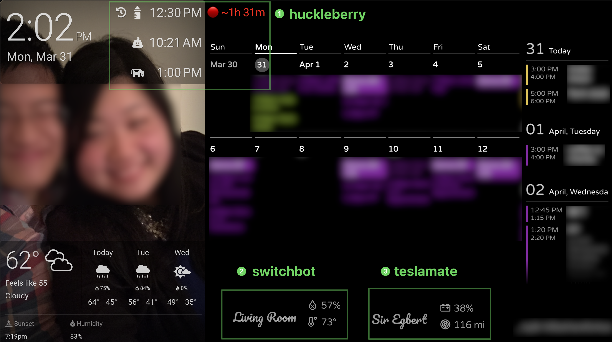

# dakboard

This is a personal server for our [dakboard](https://dakboard.com/) family calendar.

It provides a public API to access:
- a "count up" timer for last bottle based on pre-exisiting data populated from huckleberry
- battery/range of our tesla
- temp/humidity from switchbot sensors

Direct teslamate access is limited strictly to local network. 
The publicly accessible web server only exposes non-input GET endpoints that return non-sensitive data.

Example Dakboard:  

 

